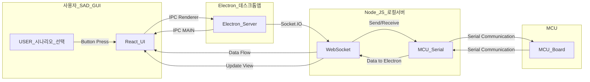

# SAD_GUI

    - SAD 프로젝트 GUI

### 1. 프로젝트 환경

    - React(프론트)
    - Node(서버)
    - Electron

### 2. 프로젝트 구조

<br>



<br>

### 3. 프로젝트 파일 구조

    my-electron-app/
    ├── public/
    ├── src/
    │   ├── App.js  // React 클라이언트
    │   └── index.js  // React 진입 파일
    ├── main/
    │   ├── main.js  // Electron 메인 프로세스
    ├── server/
    │   └── server.js  // Node.js 서버 및 Socket.IO
    ├── package.json  // 전체 프로젝트 설정 파일
    └── electron-builder.json  // Electron 빌드를 위한 설정 파일

### 4. 프로젝트 초기 설정

```bash
# 프로젝트 폴더 생성
mkdir sad_gui
cd sad_gui
# React 앱 생성
npx create-react-app sad-gui
# Electron 설치
npm install electron --save-dev
# 필요한 기타 패키지 설치
npm install express socket.io socket.io-client serialport

```

### 5. 프로젝트 다운로드

```bash
cd <your_work_space>
git init
git clone https://github.com/kyungsikjeung/SAD_GUI.git
```
